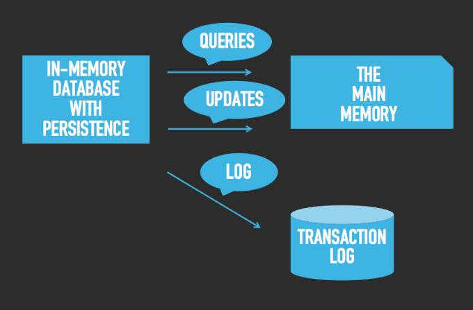

Las intrucciones: 

According to the talk by Paco Ocampo, in Google Cloud there are 8 types of databases:  Relational,  Key-Value,  Document,  In-memory,  Graph,  Search,  Time-series and Ledger.  According to wikipedia (https://en.wikipedia.org/wiki/NoSQL), you can split key-value in four types: Cache, store, store eventually consistent and store ordered. Also there are tuple-store, wide-column store and native multi-model databases.

Your work consist in two parts: 

First make a concise description of the type of databases you are researching (you can improve the content of pages such as https://www.digitalocean.com/community/tutorials/a-comparison-of-nosql-database-management-systems-and-models or https://www.accionlabs.com/articles/2018/4/9/choosing-a-nosql-database-technology-comparison-matrix). 

Second you must make a matrix of the family of databases according to the  scope like the page https://socialcompare.com/en/comparison/nosql-databases-solution-cassandra-mongodb-couchdb

You must send the link (not a txt file, not a docx) to a document in markdown hosted in github.

# Nos toco: Graph, In-memory, Search

-------------------------

# A brief introduction

When most people think of a database, they often envision the traditional relational database model (tables) made up of rows and columns. Alternative data models have become more common in recent years as developers have sought workarounds to the relational model’s limitations. These non-relational database models have come to be categorized as "NoSQL databases". This term was coined in 1998 by Carlo Strozzi simply because it doesn’t use SQL for managing data.

NoSQL databases are typically designed to maximize availability at the expense of consistency (any read operation will return the most recent data written to the database). The following image includes NoSQL data models:

# Graph databases 
The real world is richly interconnected, and graph databases aim to mimic those sometimes-consistent, sometimes-erratic relationships in an intuitive way. That’s what makes the graph paradigm different than other database models: it maps more realistically to how the human brain maps and processes the world around it.

Graph databases can be thought of as a subcategory of the document store model, in that they store data in documents and don’t insist that data adhere to a predefined schema. The difference, though, is that graph databases add an extra layer to the document model by highlighting the relationships between individual documents.

Certain operations are much simpler to perform using graph databases because of how they link and group related pieces of information. These databases are commonly used in cases where it’s important to be able to gain insights from the relationships between data points or in applications where the information available to end users is determined by their connections to others, as in a social network.

To better grasp this concept , let's understand the following terms:

**1. Node:**  This is a representation of an individual entity tracked by a graph database. It is more or less equivalent to the concept of a record or row in a relational database or a document in a document store. For example, in a graph database of music recording artists, a node might represent a single performer or band.

**2. Property:** A property is relevant information related to individual nodes. Building on our recording artist example, some properties might be “vocalist,” “jazz,” or “platinum-selling artist,” depending on what information is relevant to the database.

**3. Edge:** Also known as relationship, is the representation of how two nodes are related, and is a key concept of graph databases that differentiates them from RDBMSs and document stores. Edges can be:

  * *Undirected:* In an undirected graph, the edges between nodes exist just to show a connection between them. In this case, edges can be thought of as “two-way” relationships — there’s no implied difference between how one node relates to the other.
  
  * *Directed:* In a directed graph, edges can have different meanings based on which direction the relationship originates from. In this case, edges are “one-way” relationships. For example, a directed graph database might specify a relationship from Sammy to the Seaweeds showing that Sammy produced an album for the group, but might not show an equivalent relationship from The Seaweeds to Sammy.

In the graph world, connected data is equally (or more) important than individual data points. This connections-first approach to data means relationships and connections are persisted through every part of the data lifecycle.

Unlike other database systems, this approach means your application doesn’t have to infer data connections using things like foreign keys or out-of-band processing. The result: your data models are simpler and yet more expressive than the ones you’d produce with relational databases or the other NoSQL.
  

# In-memory
What makes this type of database so special is that it stands out for its performance. Unlike any other database, the information in here is not stored in disk nor SSDs, but instead, it keeps the whole dataset in the RAM or principal memory, all of this is with the intention (well achieved) of minimizing responding time because, of course, there's no need to access the disk. 

Now that we have established its principal characteristic, it is easy for us to see the advantages of this type of database that will be response time. Once we've understood that, the uses came to our mind pretty quickly; this kind of database is commonly used for systems that required an extremely fast (or _real time_) bidding.  

The main problem of this topic is its main advantage... given the fact that there's no such thing as a "backup" in the disk, once you reboot your system or if it crashes, all of your information gets lost. As simple as that. 

As you can imagine, there are ways to overcome that HUGE problem, there are ways to combine the power of in-memory data storage and the durability of the typical databases without affecting the performance. There are a certain tools that helps this goal, and what they mainly doo is that they indeed keep everything in memory but they also persist each operation in a transaction log through the disk. 
Here you can picture the idea.

Tools like Redis, Tarantool, or Redis are just examples of the ones that work as the image suggested.
# References

+ Mark Drake. (2019). A Comparison of NoSQL Database Management Systems and Models. [Online]. Retrieved from Digital Ocean, web site: https://www.digitalocean.com/community/tutorials/a-comparison-of-nosql-database-management-systems-and-models (june 9, 2020)
+ What Is an In-memory Database?. [Online]. Retrieved from Amazon, web site: https://aws.amazon.com/es/nosql/in-memory/ (june 10, 2020)
+ Anikin Denis. (2016) What an in-memory database is and how it persists data efficiently?. [Online]. Retrieved from Medium, web sie: https://medium.com/@denisanikin/what-an-in-memory-database-is-and-how-it-persists-data-efficiently-f43868cff4c1 (june 10, 2020)

