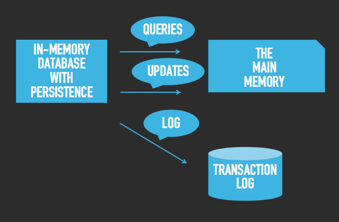

# A brief introduction

When most people think of a database, they often envision the traditional relational database model (tables) made out of rows and columns. Alternative data models have become more common in recent years as developers have sought workarounds to the relational models limitations. These non-relational database models have come to be categorized as "NoSQL databases". This term was coined in 1998 by Carlo Strozzi simply because it doesn’t use SQL for managing data.

NoSQL databases are typically designed to maximize availability at the expense of consistency (any read operation will return the most recent data written to the database). The following image includes NoSQL data models:

[Image source here](https://www.dbbest.com/technologies/nosql-databases/)

# Graph databases 
The real world is richly interconnected, and graph databases aim to mimic those sometimes-consistent, sometimes-erratic relationships in an intuitive way. That’s what makes the graph paradigm different than other database models: it maps more realistically to how the human brain maps and processes the world around it.

Graph databases can be thought of as a subcategory of the document store model, in that they store data in documents and don’t insist that data adhere to a predefined schema. The difference, though, is that graph databases add an extra layer to the document model by highlighting the relationships between individual documents.

Certain operations are much simpler to perform using graph databases because of how they link and group related pieces of information. These databases are commonly used in cases where it’s important to be able to gain insights from the relationships between data points or in applications where the information available to end users is determined by their connections to others, as in a social network.

To better grasp this concept , let's understand the following terms:

**1. Node:**  This is a representation of an individual entity tracked by a graph database. It is more or less equivalent to the concept of a record or row in a relational database or a document in a document store. For example, in a graph database of music recording artists, a node might represent a single performer or band.

**2. Property:** A property is relevant information related to individual nodes. Building on our recording artist example, some properties might be “vocalist,” “jazz,” or “platinum-selling artist,” depending on what information is relevant to the database.

**3. Edge:** Also known as relationship, is the representation of how two nodes are related, and is a key concept of graph databases that differentiates them from RDBMSs and document stores. Edges can be:

  * *Undirected:* In an undirected graph, the edges between nodes exist just to show a connection between them. In this case, edges can be thought of as “two-way” relationships — there’s no implied difference between how one node relates to the other.
  
  * *Directed:* In a directed graph, edges can have different meanings based on which direction the relationship originates from. In this case, edges are “one-way” relationships. For example, a directed graph database might specify a relationship from Sammy to the Seaweeds showing that Sammy produced an album for the group, but might not show an equivalent relationship from The Seaweeds to Sammy.

In the graph world, connected data is equally (or more) important than individual data points. This connections-first approach to data means relationships and connections are persisted through every part of the data lifecycle.

Unlike other database systems, this approach means your application doesn’t have to infer data connections using things like foreign keys or out-of-band processing. The result: your data models are simpler and yet more expressive than the ones you’d produce with relational databases or the other NoSQL.
  

[Image source here](https://www.ontotext.com/blog/graph-databases/)

# In-memory databases
What makes this type of database so special is that it stands out for its performance. Unlike any other database, the information in here is not stored in disk nor SSDs, but instead, it keeps the whole dataset in the RAM or principal memory, all of this is with the intention (well achieved) of minimizing responding time because, of course, there's no need to access the disk. 

Now that we have established its principal characteristic, it is easy for us to see the advantages of this type of database that will be response time. Once we've understood that, the uses came to our mind pretty quickly; this kind of database is commonly used for systems that required an extremely fast (or _real time_) bidding.  

The main problem of this topic is its main advantage... given the fact that there's no such thing as a "backup" in the disk, once you reboot your system or if it crashes, all of your information gets lost. As simple as that. 

As you can imagine, there are ways to overcome that HUGE problem, there are ways to combine the power of in-memory data storage and the durability of the typical databases without affecting the performance. There are a certain tools that helps this goal, and what they mainly doo is that they indeed keep everything in memory but they also persist each operation in a transaction log through the disk. 
Here you can picture the idea.

Tools like Redis, Tarantool, or Redis are just examples of the ones that work as the image suggested.

-------------------------------------------------------------------------------------------------------------------
# Search databases (or search-engine database)
Briefly, a database search engine is a search engine that operates on material stored in a digital database.
It is is a type of non-relational database that is dedicated to the search of data content. Search-engine databases use indexes to categorize the similar characteristics among data and facilitate search capability. They are also optimized for dealing with data that may be long, semistructured, or unstructured, and they typically offer specialized methods such as full-text search, complex search expressions, and ranking of search results. 

Search engines deal with data that does not conform to the rigid structural requirements of relation databases. Data for search may be long, semi-structured or unstructured.

Because search often requires dealing with large volumes of content, search engines often provide special features, such as distributed computing, for scalability.
:max_bytes(150000):strip_icc():format(webp)/GettyImages-1047578412-692fa117cf86450287d8873eeb1a95c8-aa8d654cec814174a9e07bdae85a1eb7.jpg)
[Image source](https://www.consulthink.it/es/elasticsearch-que-es-como-funciona-y-caracteristicas/)

Search-engine databases are useful for:

**Text:** search: Search-engine databases can handle full-text search faster than relational databases. For example, an e-commerce website can use search-engine databases to provide instant autocompletes or suggestions for its customers. Search-engine databases can sort relevant results based on characteristics such as name, price, category, or release data, and display the results in a structured view. 

**Logging and analysis:** Maintaining larger applications that are either distributed across several nodes or consist of several smaller applications searching for events in log files can become tedious. Search-engine databases can handle the logging more efficiently. You can centralize your logs from different applications by indexing them using a search-engine database. For example you can see the logs of your Apache web server (Database search engines are usually included with major database software products.) combined with the log files of your application server. Because all the information is available in real time, you can implement a visual representation of what is happening in your system in real time, which can help you to find problems more quickly. 

Some examples of search-engine databases are Elasticsearch, Splunk and Solr

# _Matrix Comparison_

---------------------------------------------

## Graph
| Technology     | Description (according to their web pages) |Supported programming languages|  Applications | 
|:---------------|:-------------------------------------------|:------------------------------|:--------------|
| Neo4j          | A native graph database, built from the ground up to leverage not only data but also data relationships. Neo4j connects data as it’s stored, enabling queries at high speeds. | <ul> <li>.Net</li> <li>lojure</li> <li>C</li> <li>Elixir</li> <li>Go</li> <li>Groovy</li> <li>Haskell</li> <li>Java</li> <li>Perl</li> <li>Python</li> <li>Ruby</li> <li>Scala</li> </ul> | <ul> <li>Real-Time Recommendations</li> <li>Master Data Management</li> <li> Identity and Access Management</li> <li>Network and IT Operations</li> <li>Fraud Detection</li> <li>Anti Money Laundering / Tax Evasion</li> <li>Graph-Based Search</li> <li>Knowledge Graphs</li> <li>Graph Analytics and Algorithms</li>  <li>Graph-powered Artificial Intelligence</li> <li>Smart Homes </li> <li>Internet of Things</li> </ul> |
| Microsoft Azure Cosmos DB | Azure Cosmos DB is a service with guaranteed response times of less than ten milliseconds and 99.999% availability backed by service level agreements, instant automatic scalability, and open source APIs for MongoDB and Cassandra. | <ul> <li>.Net</li> <li>C#</li> <li>JavaScript</li> <li>Java</li> <li>JavaScript (Node.js)</li> <li>MongoDB client drivers written for various programming languages</li> <li>Python </li> </ul> | Azure Cosmos DB is commonly used within web and mobile applications, and is well suited for modeling social interactions, integrating with third-party services, and for building rich personalized experiences. The Cosmos DB SDKs can be used build rich iOS and Android applications using the popular Xamarin framework.| 
| ArangoDB | Native multi-model DBMS for graph, document, key/value and search. All in one engine and accessible with one query language. | <ul> <li>C</li> <li>C++</li> <li>Clojure</li> <li>Elixir</li> <li>Go</li> <li>Java</li> <li>JavaScript(Node.js)</li> <li>PHP</li> <li>Python</li> <li>R</li> <li>Rust</li> </ul> | Single View of everything, cybersecurity, simulations in manufacturing, Identity & Access Management, Fraud detection, Recommendation Engines, Feature Engineering in Machine Learning & AI or Network Management & Surveillance are common use cases |
|OrientDB | OrientDB is the world’s leading open-source NoSQL multi-model database that powers today’s strongest enterprises and the applications they build. OrientDB allows organizations to unlock the true power of graph databases without having to deploy multiple systems to handle other data types, which increases performance and security while supporting scalability. To learn why enterprises are increasingly migrating to OrientDB, check out how our platform stacks up against other popular databases, like MongoDB and Neoj4. While you’re at it, read some of our customer success stories and see what our community of developers is up to | <ul> <li>.Net</li> <li>C</li> <li>C#</li> <li>C++</li> <li>Clojure</li>  <li>Java</li> <li>JavaScript</li> <li>JavaScript(Node.js)</li>  <li>PHP</li> <li>Python</li> <li>Ruby</li> <li>Scala</li> </ul> |<ul> <li>Banking</li> <li>Big Data</li> <li>Fraud prevention</li> <li>Loan management software (Floify)</li> <li>Master data management</li> <li>Non-coding RNA human interaction database</li> <li>Recommendation engines</li> <li>Social networking</li> <li>Traffic management systems</li> </ul>
|Virtuoso| Virtuoso is a multi-model hybrid-RDBMS that supports management of data represented as relational tables and/or property graphs |  <ul> <li>.Net</li> <li>C</li> <li>C#</li> <li>C++</li>  <li>Java</li> <li>JavaScript</li> <li>Perl</li>  <li>PHP</li> <li>Python</li> <li>Ruby</li> <li>Visual Basic</li> </ul> | <ul> <li>Analytics/BI</li> <li>Conceptual Data Virtualization</li> <li>Enterprise Knowledge Graphs bolstered by Explainable AI</li> <li>Smart & Secure Customer 360</li> <li>Smart & Secure Federated Data Lakes</li> <li>Smart & Secure MDM</li> <li>Smart & Secure Data Services</li> <li>Smart & Secure Data Governance</li> li>Smart & Secure Data Monetization</li> <li>Safe & Secure Fusion of AI and Data Access, Integration, and Management</li> </ul>

-----------------------------------------------

## In-Memory
| Technology      | Description (according to their web pages) |  Applications | Limitations| 
|:---------------|:-----------|:------------|:------------|
| Apache Ignite   |Apache Ignite is a horizontally scalable, fault-tolerant distributed in-memory computing platform for building real-time applications that can process terabytes of data with in-memory speed|1. Existing or new OTLP or OLAP applications.     2.New or existing hybrid transactional/analytical processing (HTAP) applications.   3.Support for streaming analytics    4.Continuous learning use cases involving machine or deep learning|The inability to simultaneously execute SQL on top of the data in Ignite and in the RDBMS. You can perform ANSI SQL 99 queries on the data stored in the memory of the Apache Ignite cluster, but you cannot correctly execute such queries if at least some of the data is inside a third-party DBMS|
| Aerospike DBS   |Aerospike implements a hybrid model wherein the index is purely in memory (not persisted), and data is only on a persistent storage (SSD) and is read directly from the disk. Disk I/O is not required to access the index, which makes performance predictable|This technology has several applications, but it is mostly advisable to use when have: Need for scalability and elasticity, Need for ersistance with high performance, Need for strong data consistency, Need for manageability and operational ease at scale. |Detailed here are various maximum sizes or numbers, name lengths, and character restrictions of many of the Aerospike Server objects. Maximum: 10MB per record (Aerospike Server versions earlier than 4.5. 3.4). - Maximum: 15 bytes|            
| eXtremeDB  |eXtremeDB is an in-memory embedded database system (IMDS) ideally suited for embedded systems and other application domains that require extremely high performance, small footprint, compact storage, zero memory allocations, or any combination of these attributes|It has a good performance on embedded applications in aerospace. BAE Systems uses it in Panavia Tornado GR4 combat jet... this is pretty much used in embedded and physical systems|The first one is that you have to pay :( The range of languages you can work with is very narrow|            
| Informix   |IBM Informix is a fast and scalable database server that manages traditional relational, object-relational, and dimensional databases. Its small footprint and self-managing capabilities are suited to embedded data-management solutions|You can buy IBM Informix Genero to write applications in the 4GL language. You can develop Informix applications with IBM Data Studio. You can easily embed Informix in your application. You can use command-line utilities and SQL statements to script every aspect of database server administration|As any other technology, this one has its own disadvantages like the compatibility with programming languages, but, according to my research, I couldn't find any real "problem" other its capacity to work with amazingly huge databases|            
| Arango DB   |ArangoDB is a free and open-source native multi-model database systemdeveloped by ArangoDB GmbH. The database system supports three data models (key/value, documents, graphs) with one database core and a unified query language AQL (ArangoDB Query Language). The query language is declarative and allows the combination of different data access patterns in a single query. ArangoDB is a NoSQL database system but AQL is similar in many ways to SQL.|Its first applications is in team processes. Its main advantage is its native multi-model which enables teams to cooperate across use cases. For instance, one team starts work on an application that requires a Document database while another one has another type of database|Not designed for durable persistence, not query language, very limited queries|            

-----------------------------------------------

+ ### Search
|Search Engine Database   |Description |MapReduce|APIs and other access methods|Supported programming languages|
|:-----------------------:|:----------:|:-------:|:---------------------------:|:-----------------------------:|
|Splunk                   |Analytics Platform for Big Data|Yes|HTTP REST|C#, Java, JavaScript, PHP, Python, Ruby|
|Solr                     |A widely used distributed, scalable search engine based on Apache Lucene|spark-solr: [link](github.com/­lucidworks/­spark-solr) and streaming expressions to reduce |Java API, RESTful HTTP/JSON API|.Net, Erlang, Java, JavaScript, any language that supports sockets and either XML or JSON, Perl, PHP, Python, Ruby, Scala|
|Microsoft Azure Search   |Search-as-a-service for web and mobile app development|No|RESTful HTTP API|.Net, C#|
|Amazon CloudSearch       |A hosted search engine service by Amazon with the data stored in Amazons cloud|No|HTTP API|NA|
|Alibaba Cloud Log Service|A complete real-time data logging service that supports collection, consumption, shipping, search, and analysis of logs.|ES-Hadoop Connector|HTTP REST|NA|
|Elasticsearch            |A distributed, RESTful modern search and analytics engine based on Apache Lucene|	ES-Hadoop Connector|Java API, RESTful HTTP/JSON API|.Net, Groovy, Community Contributed Clients, Java, JavaScript, Perl, PHP, Python, Ruby|

-----------------------------------------------

# References

+ Mark Drake. (2019). A Comparison of NoSQL Database Management Systems and Models. [Online]. Retrieved from Digital Ocean, website: https://www.digitalocean.com/community/tutorials/a-comparison-of-nosql-database-management-systems-and-models (june 9, 2020)
+ What Is an In-memory Database?. [Online]. Retrieved from Amazon, website: https://aws.amazon.com/es/nosql/in-memory/ (june 10, 2020)
+ Anikin Denis. (2016) What an in-memory database is and how it persists data efficiently?. [Online]. Retrieved from Medium, website: https://medium.com/@denisanikin/what-an-in-memory-database-is-and-how-it-persists-data-efficiently-f43868cff4c1 (june 10, 2020)
+ List of in-memory databases. [Online]. Retrieved from Wikipedia, website: https://en.wikipedia.org/wiki/List_of_in-memory_databases
+ Open Source In-Memory Computing Platform. [Online]. Retreived from Apache Ignite, website: https://ignite.apache.org/
+ Apache Ignite Introduction. [Online]. Retrieved from Gridgain, website: https://www.gridgain.com/resources/papers/introducing-apache-ignite 
+ Technology | Aerospike. [Online]. Retreived from Aerospike, website: https://www.aerospike.com/technology/
+ Hybrid Persistent and In-Memory database. [Online]. Retreived from McObject, web site: https://www.mcobject.com/software_eval/
+ IBM Informix. [Online]. Retreived from IBM, website: https://www.ibm.com/mx-es/products/informix
+ ArangoDB. [Online]. Retreived from Arango DB, website: https://www.arangodb.com/why-arangodb/references/
+ DB-Engines Ranking of Search Engines [online]. Retrieved from: https://db-engines.com/en/ranking/search+engine (June 14 th, 2020)
+ Brown M.(march, 2018) Get The Basics On NoSQL Databases: Search Engine Databases [online]. Retrieved from: https://www.forbes.com/sites/metabrown/2018/03/31/get-the-basics-on-nosql-databases-search-engine-databases/#60ca56d815b5 (June 14th, 2020)
+ What is asearch-engine database? [online]. Retrieved from: https://aws.amazon.com/es/nosql/search/ (June 14th, 2020).
+ DB-Engines ranking of graphs DBMS. [online]. Retrieved from https://db-engines.com/en/ranking/graph+dbms

# Authors:
+ Samuel Venegas
+ Alan Peraza
+ Mario Morales
