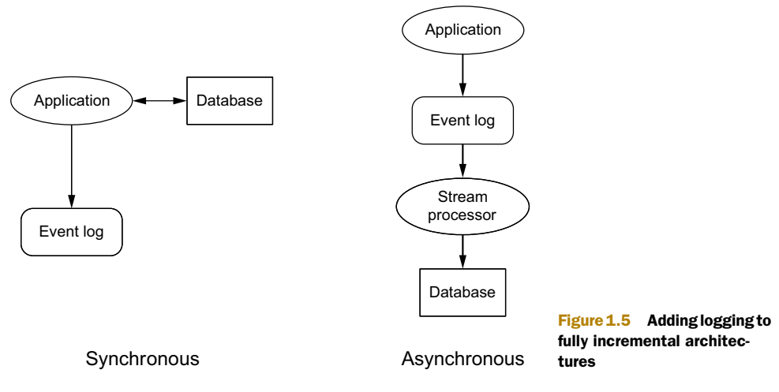

You are about to read some important aspects (according to my criteria) that best summarizes the first two chapters focused in how to approach building a solution to any Big Data problem. Make yourself comfortable and take a look to get great learning about this amazing book for Big Data ~~beginners~~.

# Chapter 1: A new paradigm for Big Data

**1. What does a data system do?**
    
A data system answers questions based on information that was acquired in the past up to the present. So a social network profile answers questions like “What is this person’s name?” and “How many friends does this person have?” Data systems don’t just memorize and regurgitate information, they combine bits and pieces together to produce their answers. Another crucial observation is that not all bits of information are equal. Some information is derived from other pieces of information. A friend count is derived from a friend list, and a friend list is derived from all the times a user added and removed friends from their profile. When you keep tracing back where information is derived from, you eventually end up at information that’s not derived from anything. This is the rawest information you have: information you hold to be true simply because it exists. Let’s call this information data, often used interchangeably with the word information. 

**2. Typical problems encountered when scaling a traditional database**
  
  Imagine that your back end consists of an RDBMS with a table of that schema and a web server. After some success, you’ll run into problems with both scalability and complexity: The database can’t keep up with the load, so write requests to increment pageviews are timing out. The best approach is to use multiple database servers and spread the table across all the servers. Each server will have a subset of the data for the table. This is known as horizontal partitioning or sharding. This technique spreads the write load across multiple machines.

  The worst problem is that the system is not engineered for human mistakes. Mistakes in software are inevitable, and if you’re not engineering for it, you might as well be writing scripts that randomly corrupt data. Backups are not enough; the system must be carefully thought out to limit the damage a human mistake can cause. Human-fault tolerance is not optional. It’s essential, especially when Big Data adds so many more complexities to building applications.
 

  

**3. Why NoSQL is not a panacea?**

  The past decade has seen a huge amount of innovation in scalable data systems. These include large-scale computation systems like Hadoop and databases such as Cassandra and Riak. These systems can handle very large amounts of data, but with serious trade-offs. These tools on their own are not a panacea. But when intelligently used in conjunction with one another, you can produce scalable systems for arbitrary data problems with human-fault tolerance and a minimum of complexity. This is the Lambda Architecture you’ll learn throughout the book.
  

**4. Which properties does Big Data system should have?**

The properties you should strive for in Big Data systems are:
  * Robustness and fault tolerance
  * Low latency reads and updates
  * Scalability
  * Generalization
  * Extensibility
  * Ad hoc queries
  * Minimal maintenance
  * Debuggability
  

**5. How to undestand the Lambda Architecture?**

  Computing arbitrary functions on an arbitrary dataset in real time is a daunting problem. There’s no single tool that provides a complete solution. Instead, you have to use a variety of tools and techniques to build a complete Big Data system. The main idea of the Lambda Architecture is to build Big Data systems as a series of layers. Each layer satisfies a subset of the properties and builds upon the functionality provided by the layers beneath it.
The beauty of this Architecture is that once data makes it through the batch layer into the serving layer, the corresponding results in the realtime views are no longer needed. This is a wonderful result, because the speed layer is far more complex than the batch and serving layers. This property of the Lambda Architecture is called complexity isolation, meaning that complexity is pushed into a layer whose results are only temporary. If anything ever goes wrong, you can discard the state for the entire speed layer, and everything will be back to normal within a few hours.

 
  
  
  
**6.high availability vs consitency in the database systems**

 It turns out that achieving high availability competes directly with another important property called consistency.  A consistent system returns results that take into account all previous writes. A theorem called the CAP theorem has shown that it’s impossible to achieve both high availability and consistency in the same system in the presence of network partitions. So a highly available system sometimes returns stale results during a network partition. 

In order for a highly available system to return to consistency once a network partition ends, a lot of help is required from your application.  During a network partition, a system that chooses to be highly available has clients update whatever replicas are reachable to them. This causes replicas to diverge and receive different sets of updates. Only when the partition goes away can the replicas be merged together into a common value. 

**7. How to create human-fault tolerance architecture?**

The inherent lack of human-fault tolerance. An incremental system is constantly modifying the state it keeps in the database, which means a mistake can also modify the state in the database. 
A  synchronous architecture where the application makes updates directly to the database, and an asynchronous architecture, where events go to a queue before updating the database in the background. In both cases, every event is permanently logged to an events datastore. By keeping every event, if a human mistake causes database corruption, you can go back to the events store and reconstruct the proper state for the database. Because the events store is immutable and constantly growing, redundant checks, like permissions, can be put in to make it highly unlikely for a mistake to trample over the events store. This technique is also core to the Lambda Architecture

# Chapter 2: Data model for Big Data

**1. Properties of data**

   * *Rawness:* When designing your Big Data system, you want to be able to answer as many questions as possible. The rawer your data, the more questions you can ask of it. 
   * *Immutability:* in the relational database world, update is one of the fundamental operations. But for immutability you don’tupdate or delete data, you only add more.With an immutable schema, things look different. Rather than storing a current snapshot of the world, as done by the mutable schema, you create a separate record every time a user’s information evolves.
   * *Perpetuity:* The key consequence of immutability is that each piece of data is true in perpetuity. That is, a piece of data, once true, must always be true. Immutability wouldn’t make sense without this property, and you saw how tagging each piece of data with a timestamp is a practical way to make data eternally true. This mentality is the same as when you learned history in school. The fact The United States consisted of thirteen states on July 4, 1776, is always true due to the specific date; the fact that the number of states has increased since then is captured in additional (also perpetual) data. 

**2. The fact-based data model:**

   * Stores your raw data as atomic facts.
   * Keeps the facts immutable and eternally true by using timestamps
   * Ensures each fact is identifiable so that query processing can identify duplicates
  

**3. Benefits of a fact-based model for Big Data:** 

With a fact-based model, the master dataset will be an ever-growing list of immutable, atomic facts. This isn’t a pattern that relational databases were built to support (if you come from a relational background, your head may be spinning). The good news is that by changing your data model paradigm, you gain numerous advantages. Specifically, your data:

  * Is queryable at any time in its history
  * Tolerates human errors
  * Handles partial information
  * Has the advantages of both normalized and denormalized forms
  
  
**4. What is a JSON file?**

JSON (JavaScript Object Notation) is a lightweight data-interchange format. It is easy for humans to read and write. It is easy for machines to parse and generate. JSON is a text format that is completely language independent but uses conventions that are familiar to programmers of the C-family of languages, including C, C++, C#, Java, JavaScript, Perl, Python, and many others. These properties make JSON an ideal data-interchange language. JSON is built on two structures:

   * A collection of name/value pairs. In various languages, this is realized as an object, record, struct, dictionary, hash table, keyed list, or associative array.

   * An ordered list of values. In most languages, this is realized as an array, vector, list, or sequence.
    
These are universal data structures. Virtually all modern programming languages support them in one form or another. It makes sense that a data format that is interchangeable with programming languages also be based on these structures.

Douglas Crockford. (*n.d*). Introducing JSON. [Online]. retrieved from web site: https://www.json.org/json-en.html (May 15, 2020)

  
**5. Why the need for an enforceable schema?**  

Information is stored as facts, and a graph schema describes the types of facts contained in the dataset. You’re all set, right? Well, not quite. You still need to decide in what format you’ll store your facts. A first idea might be to use a semistructured text format like JSON. This would provide simplicity and flexibility, allowing essentially anything to be written to the master dataset. To illustrate this problem, suppose you chose to represent someone’s age using JSON:

`
{"id": 3, "field":"age", "value":28, "timestamp": 1333589484}
`

There are no issues with the representation of this single fact, but there’s no way to
ensure that all subsequent facts will follow the same format. As a result of human
error, the dataset could also possibly include facts like these:

 `
{"name":"Alice", "field":"age", "value":25, "timestamp":"2012/03/29 08:12:24"}
{"id":2, "field":"age", "value":36}
 `
 
Both of these examples are valid JSON, but they have inconsistent formats or missing
data. To effectively use your data, you must provide guarantees about the contents of your dataset. 
