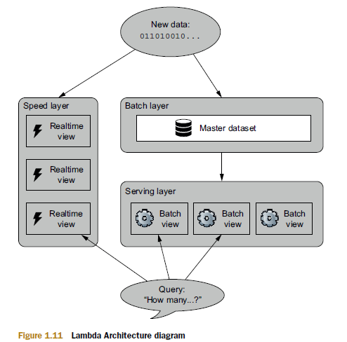

You are about to read some important aspects (according to my criteria) that best summarizes the first two chapters focused in how to approach building a solution to any Big Data problem. Make yourself comfortable and take a look to get great learning about this amazing book for Big Data ~~beginners~~.

# Chapter 1: A new paradigm for Big Data

1. **Typical problems encountered when scaling a traditional database**
  
  Imagine that your back end consists of an RDBMS with a table of that schema and a web server. After some success, you’ll run into problems with both scalability and complexity: The database can’t keep up with the load, so write requests to increment pageviews are timing out. The best approach is to use multiple database servers and spread the table across all the servers. Each server will have a subset of the data for the table. This is known as horizontal partitioning or sharding. This technique spreads the write load across multiple machines.

  The worst problem is that the system is not engineered for human mistakes. Mistakes in software are inevitable, and if you’re not engineering for it, you might as well be writing scripts that randomly corrupt data. Backups are not enough; the system must be carefully thought out to limit the damage a human mistake can cause. Human-fault tolerance is not optional. It’s essential, especially when Big Data adds so many more complexities to building applications.
 

  

2. **Why NoSQL is not a panacea**

  The past decade has seen a huge amount of innovation in scalable data systems. These include large-scale computation systems like Hadoop and databases such as Cassandra and Riak. These systems can handle very large amounts of data, but with serious trade-offs. These tools on their own are not a panacea. But when intelligently used in conjunction with one another, you can produce scalable systems for arbitrary data problems with human-fault tolerance and a minimum of complexity. This is the Lambda Architecture you’ll learn throughout the book.
  

3. **Thinking about Big Data systems from first principles**

  A data system answers questions based on information that was acquired in the past up to the present. So a social network profile answers questions like “What is this person’s name?” and “How many friends does this person have?” Data systems don’t just memorize and regurgitate information, they combine bits and pieces together to produce their answers. Another crucial observation is that not all bits of information are equal. Some information is derived from other pieces of information. A friend count is derived from a friend list, and a friend list is derived from all the times a user added and removed friends from their profile. This is the rawest information you have: information you hold to be true simply because it exists. Let’s call this information data, often used interchangeably with the word information. For the remainder of this book, we use  data when referring to that special information from which everything else is derived.
The properties you should strive for in Big Data systems are:
  * Robustness and fault tolerance
  * Low latency reads and updates
  * Scalability
  * Generalization
  * Extensibility
  * Ad hoc queries
  * Minimal maintenance
  * Debuggability
  

4. **Lambda Architecture**

  Computing arbitrary functions on an arbitrary dataset in real time is a daunting problem. There’s no single tool that provides a complete solution. Instead, you have to use a variety of tools and techniques to build a complete Big Data system. The main idea of the Lambda Architecture is to build Big Data systems as a series of layers. Each layer satisfies a subset of the properties and builds upon the functionality provided by the layers beneath it.
The beauty of this Architecture is that once data makes it through the batch layer into the serving layer, the corresponding results in the realtime views are no longer needed. This is a wonderful result, because the speed layer is far more complex than the batch and serving layers. This property of the Lambda Architecture is called complexity isolation, meaning that complexity is pushed into a layer whose results are only temporary. If anything ever goes wrong, you can discard the state for the entire speed layer, and everything will be back to normal within a few hours.

 
  
  
  
5. **Introducing SuperWebAnalytics.com**

  You’ll build the data management layer for a Google Analytics–like service throughout this book. The service will be able to track billions of pageviews per day. The service will support a variety of different metrics. Each metric will be supported in real time. The metrics range from simple counting metrics to complex analyses
of how visitors are navigating a website. These are the metrics you’ll support:
    * Pageview counts by URL sliced by time
    * Unique visitors by URL sliced by time
    * Bounce-rate analysis

# Chapter 2: Data model for Big Data 27

1. **Properties of data**
  * rawness:When designing your Big Data system, you want to be able to answer as many questions as possible. The rawer your data, the more questions you can ask of it. 
  * immutability: in the relational database world, update is one of the fundamental operations. But for immutability you don’tupdate or delete data, you only add more.With an immutable schema, things look different. Rather than storing a current snapshot of the world, as done by the mutable schema, you create a separate record every time a user’s information evolves.
  * perpetuity (or the “eternal trueness of data”): The key consequence of immutability is that each piece of data is true in perpetuity. That is, a piece of data, once true, must always be true. Immutability wouldn’t make sense without this property, and you saw how tagging each piece of data with a timestamp is a practical way to make data eternally true. This mentality is the same as when you learned history in school. The fact The United States consisted of thirteen states on July 4, 1776, is always true due to the specific date; the fact that the number of states has increased since then is captured in additional (also perpetual) data. 

2. **The fact-based data model:**
  * Stores your raw data as atomic facts.
  * Keeps the facts immutable and eternally true by using timestamps
  * Ensures each fact is identifiable so that query processing can identify duplicates
  

3. **Benefits of a fact-based model for Big Data:** With a fact-based model, the master dataset will be an ever-growing list of immutable, atomic facts. This isn’t a pattern that relational databases were built to support—if you come from a relational background, your head may be spinning. The good news is that by changing your data model paradigm, you gain numerous advantages. Specifically, your data:
  * Is queryable at any time in its history
  * Tolerates human errors
  * Handles partial information
  * Has the advantages of both normalized and denormalized forms
  
  
4. **Graph schemas:**  Each fact within a fact-based model captures a single piece of information. But the facts alone don’t convey the structure behind the data. That is, there’s no description of the types of facts contained in the dataset, nor any explanation of the relationships between them. The alternative is to use an enforceable schema that rigorously defines the structure of your facts. Enforceable schemas require a bit more work upfront such as JSON, but they guarantee all required fields are present and ensure all values are of the expected type. With these assurances, a developer will be confident about what data they can expect—that each fact will have a timestamp, that a user’s name will always be a string, and so forth. The key is that when a mistake is made creating a piece of data, an enforceable schema will give errors at that time, rather than when someone is trying to use the data later in a different system. The closer the error appears to the bug, the easier it is to catch and fix.
